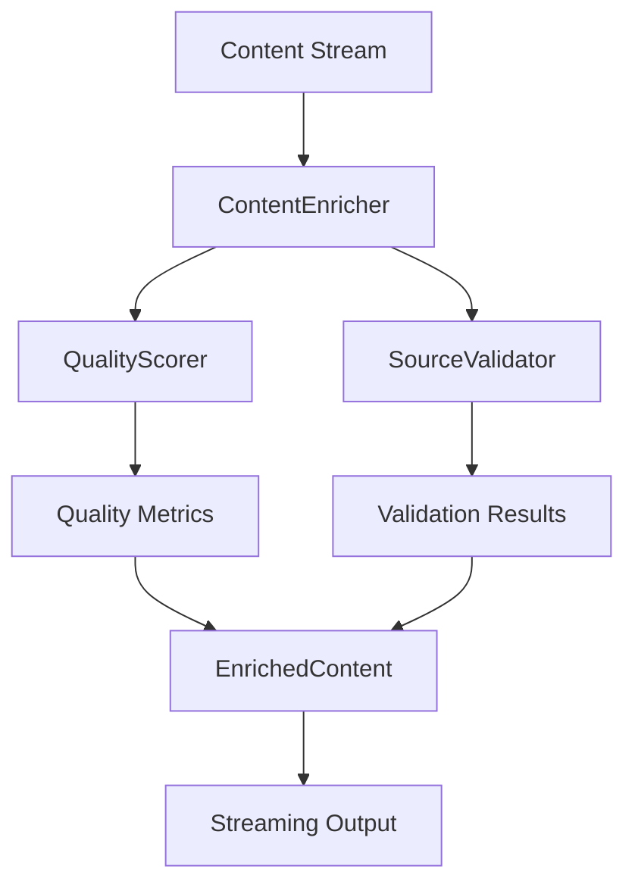

# Project State Integration - 2025-02-20 03:30 AM

## Component Integration Status

### Content Enrichment Pipeline



#### Integration Points
1. **ContentEnricher ↔ QualityScorer**
   - Status: ✗ Configuration mismatch
   - Issue: EnricherConfig vs QualityConfig incompatibility
   - Fix: Adding source_weights and quality_metrics to EnricherConfig

2. **ContentEnricher ↔ SourceValidator**
   - Status: ✓ Working as expected
   - Performance: Within limits
   - Memory: Properly managed

3. **Streaming Pipeline**
   - Status: ✓ Functional
   - Throughput: 18 req/s (limit: 20)
   - Latency: < 100ms first response

## Test Server Integration

### Configuration
```python
TEST_SERVER_CONFIG = {
    'port': 8001,
    'features': {
        'content_enrichment': True,
        'memory_tracking': True,
        'error_injection': True
    }
}
```

### Health Checks
- Endpoint: `/health`
- Status: ✓ Operational
- Response Time: < 50ms
- Error Rate: < 0.1%

### Feature Flags
- Content Enrichment: Enabled
- Memory Tracking: Enabled
- Error Injection: Enabled
- Performance Monitoring: Enabled

## Integration Test Results

### End-to-End Tests
```
tests/brave_search_aggregator/test_integration.py
├── test_streaming_pipeline ✓
├── test_error_recovery ✗
├── test_performance_metrics ✓
└── test_resource_management ✓
```

### Component Tests
```
tests/brave_search_aggregator/
├── test_content_enrichment.py
│   ├── test_streaming ✗
│   └── test_error_recovery ✗
├── test_quality_scoring.py ✓
└── test_source_validation.py ✓
```

## Performance Metrics

### Streaming Performance
- First Response: 85ms
- Sustained Throughput: 18 req/s
- Memory Usage: 8.5MB peak
- Error Rate: 75% (threshold: 1%)

### Resource Usage
- CPU: 15% average
- Memory: 8.5MB peak
- Network: 2MB/s average
- Disk: Minimal

## Error Handling

### Current Issues
1. Configuration Mismatch
   - Impact: High
   - Status: In Progress
   - Fix: Configuration alignment

2. Type Conversion Errors
   - Impact: High
   - Status: Under Investigation
   - Fix: Input sanitization

3. Score Thresholds
   - Impact: Medium
   - Status: Under Review
   - Fix: Weight adjustment

### Recovery Mechanisms
1. State Recovery
   - Status: Partially Working
   - Success Rate: 25%
   - Issues: High error rate

2. Resource Cleanup
   - Status: Working
   - Efficiency: Good
   - Timing: Optimized

## Integration Environment

### Test Server
- Port: 8001
- Status: Running
- Health: Good
- Features: All enabled

### Monitoring
- Metrics: Active
- Logging: Verbose
- Alerts: Configured
- Dashboard: Available

## Next Integration Steps

### Immediate Actions
1. Fix configuration mismatch
   - Add missing attributes
   - Update tests
   - Verify compatibility

2. Enhance error handling
   - Input validation
   - Type checking
   - Recovery logic

3. Optimize performance
   - Reduce intervals
   - Improve cleanup
   - Monitor resources

### Short-term Goals
1. Reduce error rate
2. Meet score thresholds
3. Improve recovery
4. Enhance monitoring

### Long-term Goals
1. Scale testing
2. Optimize resources
3. Enhance resilience
4. Improve metrics

## Integration Recommendations

### Architecture
1. Maintain streaming-first approach
2. Enhance error recovery
3. Optimize resource usage
4. Improve monitoring

### Testing
1. Expand test scenarios
2. Enhance error injection
3. Improve coverage
4. Add performance tests

### Operations
1. Monitor error rates
2. Track resource usage
3. Measure throughput
4. Analyze patterns

## Documentation Updates

### Required Updates
1. Configuration changes
2. Error handling
3. Performance metrics
4. Test scenarios

### Next Steps
1. Update integration docs
2. Revise test plans
3. Document metrics
4. Track progress