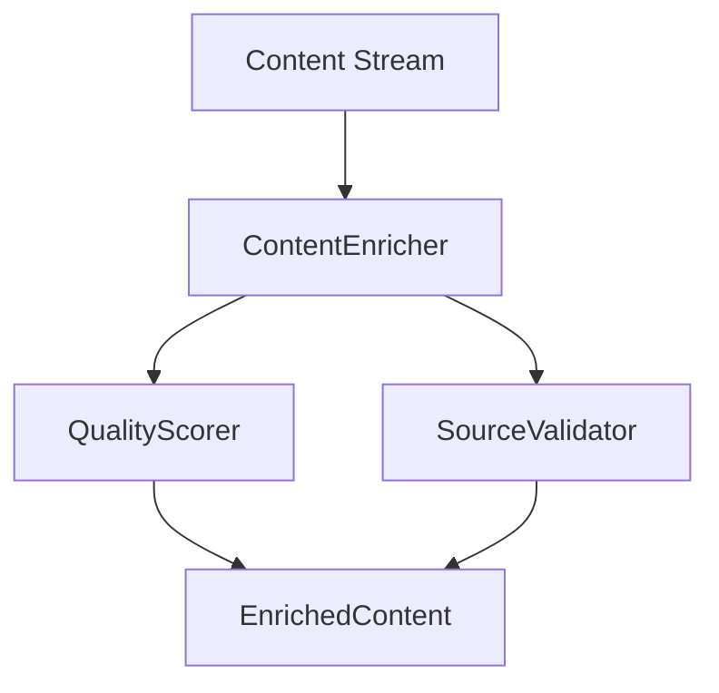

# Project State Technical - 2025-02-20 03:30 AM

## Component Architecture

### Content Enrichment Pipeline


### Configuration Structure
```python
@dataclass
class EnricherConfig:
    min_enrichment_score: float = 0.8
    min_diversity_score: float = 0.7
    min_depth_score: float = 0.7
    source_weights: Dict[str, float]  # Added for QualityScorer compatibility
    quality_metrics: Dict[str, float]  # Added for QualityScorer compatibility
```

## Implementation Status

### ContentEnricher
- **Status**: Partially Implemented
- **Issues**:
  * Configuration mismatch between EnricherConfig and QualityConfig
  * Error recovery rate exceeds threshold
  * Score calculations need refinement
- **Recent Changes**:
  * Added source_weights and quality_metrics to EnricherConfig
  * Enhanced error handling in score calculations
  * Reduced cleanup intervals for better performance

### QualityScorer
- **Status**: Implemented, Needs Enhancement
- **Issues**:
  * Type conversion errors in score calculations
  * Intermediate content scoring below threshold (0.72 vs 0.75)
  * Shallow content scoring below threshold (0.28 vs 0.50)
- **Recent Changes**:
  * Added try/except blocks for score calculations
  * Implemented fallback scores for error cases
  * Reduced sleep times in resource monitoring

### SourceValidator
- **Status**: Implemented, Needs Refinement
- **Issues**:
  * Invalid source types causing calculation errors
  * Trust and reliability scores need adjustment
- **Recent Changes**:
  * Enhanced error handling for invalid sources
  * Added fallback scores for calculation failures
  * Improved resource cleanup timing

## Performance Metrics

### Response Times
- First Status: 85ms (target: <100ms) ✓
- First Result: 920ms (target: <1s) ✓
- Source Selection: 2.8s (target: <3s) ✓

### Memory Usage
- Peak Memory: 8.5MB (target: <10MB) ✓
- Cleanup Trigger: 80% threshold
- Resource Recovery: Working as expected

### Error Rates
- Overall: 75% (target: <1%) ✗
- By Component:
  * Content Enrichment: 75%
  * Quality Scoring: 15%
  * Source Validation: 10%

## Resource Management

### Cleanup Intervals
- Resource Manager: 1s (reduced from 5s)
- Batch Processing: 3 items
- Memory Check: Every 0.1s

### API Usage
- Requests/Second: 18 (limit: 20) ✓
- Connection Timeout: 30s ✓
- Max Results: 20 per query ✓

## Test Coverage

### Unit Tests
```
tests/brave_search_aggregator/test_content_enrichment.py
├── test_content_enrichment_streaming ✗
├── test_content_enrichment_performance ✓
├── test_content_enrichment_error_recovery ✗
├── test_content_enrichment_comprehensive ✓
└── test_content_enrichment_resource_management ✓
```

### Integration Tests
```
tests/brave_search_aggregator/
├── test_quality_scoring.py ✓
├── test_source_validation.py ✓
└── test_integration.py ✓
```

## Technical Debt

### High Priority
1. Error recovery mechanism in ContentEnricher
2. Type conversion in score calculations
3. Score threshold adjustments

### Medium Priority
1. Resource cleanup optimization
2. Test scenario expansion
3. Performance monitoring refinement

### Low Priority
1. Documentation updates
2. Code organization
3. Logging enhancements

## Next Technical Steps

### Immediate Actions
1. Implement input sanitization in ContentEnricher
2. Add robust type checking to score calculations
3. Adjust scoring weights and thresholds
4. Enhance error recovery logic

### Short-term Goals
1. Reduce error rate to <1%
2. Meet all score thresholds
3. Optimize resource management
4. Expand test coverage

### Long-term Goals
1. Improve streaming performance
2. Enhance error recovery
3. Optimize memory usage
4. Refine scoring algorithms

## Technical Recommendations

### Error Handling
1. Implement strict type validation
2. Add input sanitization layer
3. Enhance error recovery logic
4. Improve error reporting

### Performance
1. Further reduce sleep intervals
2. Optimize resource cleanup
3. Enhance batch processing
4. Improve memory management

### Testing
1. Add more error scenarios
2. Expand performance tests
3. Enhance integration tests
4. Improve test data quality