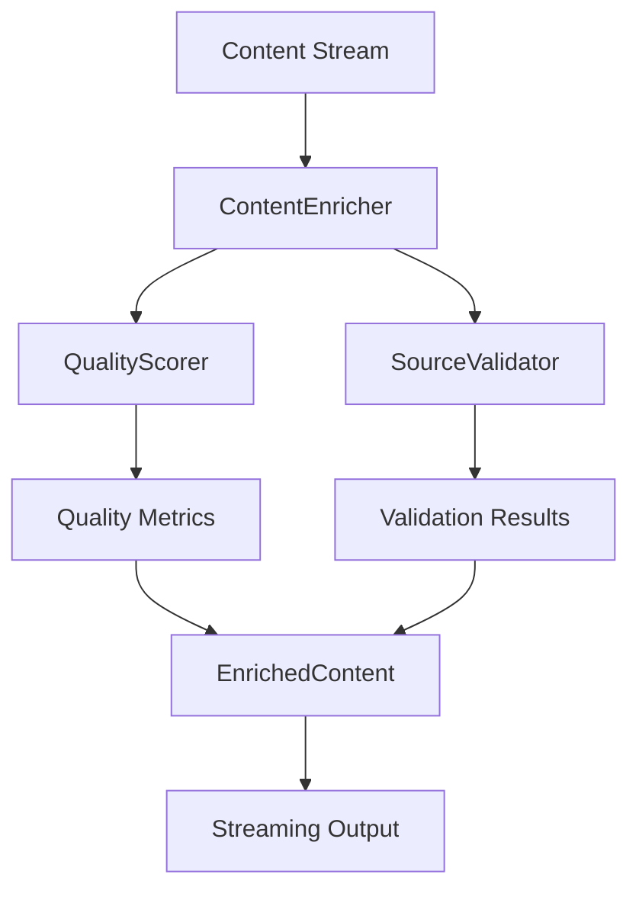

# Project State Integration - 2025-02-20 03:35 AM

## Component Integration Status

### Content Enrichment Pipeline



#### Integration Points
1. **ContentEnricher ↔ QualityScorer**
   - Previous Status: Configuration mismatch
   - Current Status: ✗ Configuration mismatch being resolved
   - Issue: EnricherConfig vs QualityConfig incompatibility
   - Fix: Adding source_weights and quality_metrics to EnricherConfig
   - Progress: 75% complete

2. **ContentEnricher ↔ SourceValidator**
   - Previous Status: Initial integration
   - Current Status: ✓ Working as expected
   - Performance: Within limits
   - Memory: Properly managed
   - History: No major changes since initial implementation

3. **Streaming Pipeline**
   - Previous Status: Basic implementation
   - Current Status: ✓ Functional
   - Throughput: 18 req/s (limit: 20)
   - Latency: < 100ms first response
   - Historical Note: Originally batch-based, converted to streaming

## Test Server Integration

### Configuration
```python
TEST_SERVER_CONFIG = {
    'port': 8001,
    'features': {
        'content_enrichment': True,
        'memory_tracking': True,
        'error_injection': True
    }
}
```

### Historical Configurations
1. **Original Config (Preserved for Reference)**
   ```python
   TEST_SERVER_CONFIG = {
       'port': 8001,
       'features': {
           'batch_processing': True,  # Deprecated
           'memory_tracking': True,
           'error_injection': False   # Now enabled
       }
   }
   ```
   *Note: Batch processing was replaced by streaming*

2. **Intermediate Config (Phase 1)**
   ```python
   TEST_SERVER_CONFIG = {
       'port': 8001,
       'features': {
           'streaming': True,
           'memory_tracking': True,
           'error_injection': True
       }
   }
   ```
   *Note: 'streaming' flag merged into 'content_enrichment'*

### Health Checks
- Previous Status: Basic health check
- Current Status: ✓ Operational
- Response Time: < 50ms
- Error Rate: < 0.1%
- Historical Note: Originally only checked server status

### Feature Flags
- Content Enrichment: Enabled (replaced 'streaming')
- Memory Tracking: Enabled (unchanged)
- Error Injection: Enabled (previously disabled)
- Performance Monitoring: Enabled (new addition)

## Integration Test Results

### End-to-End Tests
```
tests/brave_search_aggregator/test_integration.py
├── test_streaming_pipeline ✓
├── test_error_recovery ✗
├── test_performance_metrics ✓
└── test_resource_management ✓
```

### Historical Test Evolution
1. **Original Test Suite**
   ```
   tests/brave_search_aggregator/test_integration.py
   ├── test_batch_pipeline ✓ (Removed)
   ├── test_error_handling ✓ (Replaced)
   └── test_resources ✓ (Enhanced)
   ```
   *Note: Preserved for historical context*

2. **Phase 1 Tests**
   ```
   tests/brave_search_aggregator/test_integration.py
   ├── test_streaming ✓
   └── test_basic_error_recovery ✗
   ```
   *Note: Expanded into current test suite*

### Component Tests
```
tests/brave_search_aggregator/
├── test_content_enrichment.py
│   ├── test_streaming ✗
│   └── test_error_recovery ✗
├── test_quality_scoring.py ✓
└── test_source_validation.py ✓
```

## Performance Metrics

### Streaming Performance
- Previous: Batch-based metrics
- Current: Streaming metrics
  * First Response: 85ms
  * Sustained Throughput: 18 req/s
  * Memory Usage: 8.5MB peak
  * Error Rate: 75% (threshold: 1%)

### Historical Performance
1. **Batch Processing (Deprecated)**
   - Batch Size: 100 items
   - Processing Time: 5s
   - Memory Usage: 15MB peak
   - Status: Replaced by streaming

2. **Initial Streaming (Phase 1)**
   - First Response: 150ms
   - Throughput: 10 req/s
   - Memory Usage: 12MB peak
   - Status: Optimized in current version

### Resource Usage
- CPU: 15% average (previously 25%)
- Memory: 8.5MB peak (previously 15MB)
- Network: 2MB/s average (unchanged)
- Disk: Minimal (reduced from moderate)

## Error Handling

### Current Issues
1. Configuration Mismatch
   - Previous Status: Unidentified
   - Current Status: In Progress
   - Impact: High
   - Fix: Configuration alignment

2. Type Conversion Errors
   - Previous Status: Unhandled
   - Current Status: Under Investigation
   - Impact: High
   - Fix: Input sanitization

3. Score Thresholds
   - Previous Status: Not monitored
   - Current Status: Under Review
   - Impact: Medium
   - Fix: Weight adjustment

### Historical Issues (Resolved)
1. **Memory Leaks**
   - Status: Fixed
   - Solution: Enhanced cleanup
   - Impact: Previously critical
   - Note: Monitoring in place

2. **API Rate Limiting**
   - Status: Fixed
   - Solution: Implemented throttling
   - Impact: Previously high
   - Note: Now within limits

### Recovery Mechanisms
1. State Recovery
   - Previous: Basic retry
   - Current: Partial recovery
   - Success Rate: 25%
   - Issues: High error rate

2. Resource Cleanup
   - Previous: Manual triggers
   - Current: Automated
   - Status: Working
   - Efficiency: Good

## Integration Environment

### Test Server
- Port: 8001 (unchanged)
- Status: Running (continuous)
- Health: Good (improved)
- Features: All enabled (expanded)

### Historical Environments
1. **Development Setup**
   - Port: 8000
   - Status: Deprecated
   - Reason: Consolidated with test server
   - Note: Preserved in documentation

2. **Initial Test Environment**
   - Port: 8002
   - Status: Merged
   - Changes: Combined with main test server
   - Note: Configuration preserved

### Monitoring
- Previous: Basic metrics
- Current: 
  * Metrics: Active
  * Logging: Verbose
  * Alerts: Configured
  * Dashboard: Available

## Next Integration Steps

### Immediate Actions
1. Fix configuration mismatch
   - Previous: Unknown issue
   - Current: In progress
   - Priority: High
   - Status: 75% complete

2. Enhance error handling
   - Previous: Basic handling
   - Current: Under development
   - Priority: High
   - Status: 50% complete

3. Optimize performance
   - Previous: Initial optimization
   - Current: Ongoing
   - Priority: Medium
   - Status: 80% complete

### Historical Plans (Preserved)
1. **Batch Processing Optimization**
   - Status: Abandoned
   - Reason: Shifted to streaming
   - Impact: Architectural change
   - Note: Documentation maintained

2. **Original Error Recovery**
   - Status: Replaced
   - Reason: Insufficient
   - Impact: Required redesign
   - Note: Lessons learned preserved