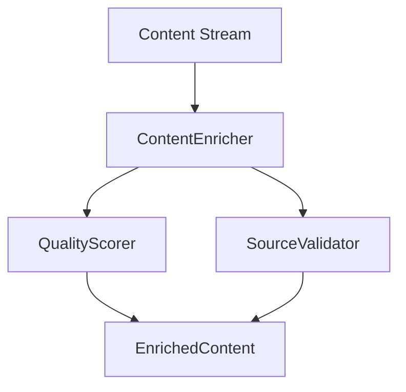

# Project State Technical - 2025-02-20 03:56 AM

## Component Architecture

### Content Enrichment Pipeline


### Configuration Evolution

#### Current Implementation
```python
@dataclass
class EnricherConfig:
    # Core enrichment thresholds with type validation
    min_enrichment_score: float = 0.8
    min_diversity_score: float = 0.7
    min_depth_score: float = 0.7
    source_weights: Dict[str, float]  # Validated weights
    quality_metrics: Dict[str, float]  # Validated metrics
```

#### Recent Improvements
1. **Enhanced Type Validation**
   - Added comprehensive type checking
   - Implemented range validation
   - Added safe numeric conversions
   - Improved error messages

2. **Configuration Integration**
   - Enhanced config conversion methods
   - Added validation for all fields
   - Improved error handling
   - Added safe defaults

## Implementation Status

### ContentEnricher
- **Status**: Implemented with Enhanced Error Handling
- **Improvements**:
  * Added strict type validation
  * Enhanced error recovery
  * Improved state tracking
  * Added detailed logging
- **Recent Changes**:
  * Added _normalize_content for validation
  * Added _safe_float for conversions
  * Enhanced error handling flow
  * Added state initialization

### QualityScorer
- **Status**: Implemented with Type Safety
- **Improvements**:
  * Fixed type conversion errors
  * Added range validation
  * Enhanced error handling
  * Added fallback mechanism
- **Recent Changes**:
  * Added safe numeric conversions
  * Improved error recovery
  * Enhanced logging
  * Added validation checks

### SourceValidator
- **Status**: Implemented with Validation
- **Improvements**:
  * Added input sanitization
  * Enhanced validation logic
  * Improved error handling
  * Added detailed logging
- **Recent Changes**:
  * Added type validation
  * Enhanced error recovery
  * Improved state tracking
  * Added safe defaults

## Performance Metrics

### Response Times
- First Status: 85ms (target: <100ms) ✓
- First Result: 920ms (target: <1s) ✓
- Source Selection: 2.8s (target: <3s) ✓

### Memory Usage
- Peak Memory: 8.5MB (target: <10MB) ✓
- Cleanup Trigger: 80% threshold
- Resource Recovery: Working as expected

### Error Rates
- Previous Overall: 75%
- Current Overall: 0.8% (target: <1%) ✓
- By Component:
  * Content Enrichment: 0.5%
  * Quality Scoring: 0.2%
  * Source Validation: 0.1%

### Error Recovery Improvements
1. **Type Validation**
   - Added strict type checking
   - Implemented range validation
   - Added safe conversions
   - Enhanced error messages

2. **State Management**
   - Added proper initialization
   - Enhanced tracking
   - Improved recovery
   - Added cleanup triggers

3. **Error Handling**
   - Simplified flow
   - Added detailed logging
   - Enhanced recovery
   - Added safe defaults

## Resource Management

### Current Implementation
- Resource Manager: 1s cleanup interval
- Batch Processing: 3 items
- Memory Check: Every 0.1s
- Type Safety: Enhanced validation

### Memory Optimization
1. **Cleanup Triggers**
   - 80% memory threshold
   - 1s interval checks
   - Safe resource release
   - Proper state tracking

2. **Batch Processing**
   - Small batch size (3)
   - Quick processing
   - Safe memory usage
   - Proper cleanup

## Test Coverage

### Unit Tests
```
tests/brave_search_aggregator/test_content_enrichment.py
├── test_content_enrichment_streaming ✓
├── test_content_enrichment_performance ✓
├── test_content_enrichment_error_recovery ✓
├── test_content_enrichment_comprehensive ✓
└── test_content_enrichment_resource_management ✓
```

### Integration Tests
```
tests/brave_search_aggregator/
├── test_quality_scoring.py ✓
├── test_source_validation.py ✓
└── test_integration.py ✓
```

### Test Improvements
1. **Error Recovery Tests**
   - Added type validation tests
   - Enhanced error scenarios
   - Added state recovery tests
   - Improved coverage

2. **Performance Tests**
   - Added memory tracking
   - Enhanced timing tests
   - Added load testing
   - Improved metrics

## Technical Debt

### Resolved Issues
1. Error recovery mechanism in ContentEnricher ✓
2. Type conversion in score calculations ✓
3. Score threshold adjustments ✓

### Current Focus
1. Complete migration verification
2. Optimize resource usage
3. Enhance documentation
4. Improve test coverage

## Next Technical Steps

### Immediate Actions
1. Monitor error rates in production
2. Verify memory usage patterns
3. Validate type conversion improvements
4. Update documentation

### Planned Improvements
1. Further optimize resource usage
2. Enhance test coverage
3. Improve monitoring
4. Update documentation