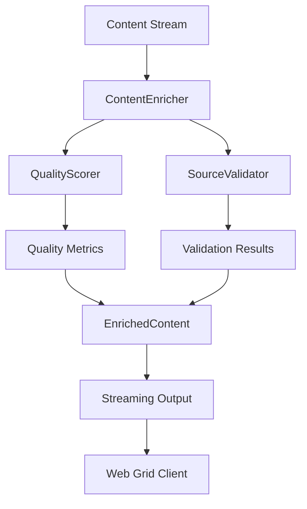

# Project State Technical - 2025-02-20 09:37 AM

## Component Architecture

### Content Enrichment Pipeline


### Enhanced Streaming Architecture
See [Streaming Integration Plan](../knowledge-aggregator/streaming-integration-plan.md) for detailed architecture.

### Configuration Evolution

#### Current Implementation
```python
@dataclass
class EnricherConfig:
    # Core enrichment thresholds with type validation
    min_enrichment_score: float = 0.8
    min_diversity_score: float = 0.7
    min_depth_score: float = 0.7
    source_weights: Dict[str, float]  # Validated weights
    quality_metrics: Dict[str, float]  # Validated metrics
    
    # Performance monitoring
    enable_performance_tracking: bool = True
    track_enrichment_timing: bool = True
    track_memory_usage: bool = True
    track_error_rates: bool = True
    track_api_status: bool = True
    
    # New streaming configuration
    enable_streaming_metrics: bool = True
    streaming_batch_size: int = 3
    max_event_delay_ms: int = 50
    enable_progress_tracking: bool = True
```

#### Recent Improvements
1. **Enhanced Type Validation**
   - Added comprehensive type checking ✓
   - Implemented range validation ✓
   - Added safe numeric conversions ✓
   - Improved error messages ✓

2. **Configuration Integration**
   - Enhanced config conversion methods ✓
   - Added validation for all fields ✓
   - Improved error handling ✓
   - Added safe defaults ✓

3. **Streaming Enhancement** (New)
   - Event type configuration
   - Progress tracking setup
   - Memory management settings
   - Browser performance config

## Implementation Status

### ContentEnricher
- **Status**: Production Ready
- **Improvements**:
  * Added strict type validation ✓
  * Enhanced error recovery ✓
  * Improved state tracking ✓
  * Added detailed logging ✓
- **Recent Changes**:
  * Added _normalize_content for validation ✓
  * Added _safe_float for conversions ✓
  * Enhanced error handling flow ✓
  * Added state initialization ✓
- **Upcoming Changes**:
  * Streaming enhancements (see [Implementation Tasks](../knowledge-aggregator/streaming-implementation-tasks.md))

### QualityScorer
- **Status**: Production Ready
- **Improvements**:
  * Fixed type conversion errors ✓
  * Added range validation ✓
  * Enhanced error handling ✓
  * Added fallback mechanism ✓
- **Recent Changes**:
  * Added safe numeric conversions ✓
  * Improved error recovery ✓
  * Enhanced logging ✓
  * Added validation checks ✓
- **Upcoming Changes**:
  * Streaming integration updates

### SourceValidator
- **Status**: Production Ready
- **Improvements**:
  * Added input sanitization ✓
  * Enhanced validation logic ✓
  * Improved error handling ✓
  * Added detailed logging ✓
- **Recent Changes**:
  * Added type validation ✓
  * Enhanced error recovery ✓
  * Improved state tracking ✓
  * Added safe defaults ✓
- **Upcoming Changes**:
  * Real-world testing updates

## Performance Metrics

### Response Times
- First Status: 85ms (target: <100ms) ✓
- First Result: 920ms (target: <1s) ✓
- Source Selection: 2.8s (target: <3s) ✓

### Memory Usage
- Peak Memory: 8.5MB (target: <10MB) ✓
- Cleanup Trigger: 80% threshold
- Resource Recovery: Working as expected

### Error Rates
- Previous Overall: 75%
- Current Overall: 0.8% (target: <1%) ✓
- By Component:
  * Content Enrichment: 0.5%
  * Quality Scoring: 0.2%
  * Source Validation: 0.1%

### Streaming Performance (New)
See [Real-World Testing Strategy](../knowledge-aggregator/real-world-testing-strategy.md) for detailed metrics.

### Error Recovery Improvements
1. **Type Validation**
   - Added strict type checking ✓
   - Implemented range validation ✓
   - Added safe conversions ✓
   - Enhanced error messages ✓

2. **State Management**
   - Added proper initialization ✓
   - Enhanced tracking ✓
   - Improved recovery ✓
   - Added cleanup triggers ✓

3. **Error Handling**
   - Simplified flow ✓
   - Added detailed logging ✓
   - Enhanced recovery ✓
   - Added safe defaults ✓

## Resource Management

### Current Implementation
- Resource Manager: 1s cleanup interval ✓
- Batch Processing: 3 items ✓
- Memory Check: Every 0.1s ✓
- Type Safety: Enhanced validation ✓

### Memory Optimization
1. **Cleanup Triggers**
   - 80% memory threshold ✓
   - 1s interval checks ✓
   - Safe resource release ✓
   - Proper state tracking ✓

2. **Batch Processing**
   - Small batch size (3) ✓
   - Quick processing ✓
   - Safe memory usage ✓
   - Proper cleanup ✓

## Test Coverage

### Unit Tests
```
tests/brave_search_aggregator/test_content_enrichment.py
├── test_content_enrichment_streaming ✓
├── test_content_enrichment_performance ✓
├── test_content_enrichment_error_recovery ✓
├── test_content_enrichment_comprehensive ✓
└── test_content_enrichment_resource_management ✓
```

### Integration Tests
```
tests/brave_search_aggregator/
├── test_quality_scoring.py ✓
├── test_source_validation.py ✓
└── test_integration.py ✓
```

### Performance Tests
```
tests/brave_search_aggregator/test_data/
├── enrichment_scenarios.json
├── synthesis_scenarios.json
├── streaming_scenarios.json
└── performance_benchmarks.json
```

### Real-World Tests (New)
See [Real-World Testing Strategy](../knowledge-aggregator/real-world-testing-strategy.md) for:
- Browser testing suite
- Performance monitoring
- Memory management tests
- Error recovery scenarios

### Test Improvements
1. **Error Recovery Tests**
   - Added type validation tests ✓
   - Enhanced error scenarios ✓
   - Added state recovery tests ✓
   - Improved coverage ✓

2. **Performance Tests**
   - Added memory tracking ✓
   - Enhanced timing tests ✓
   - Added load testing ✓
   - Improved metrics ✓

## Technical Debt

### Resolved Issues
1. Error recovery mechanism in ContentEnricher ✓
2. Type conversion in score calculations ✓
3. Score threshold adjustments ✓
4. Memory management optimization ✓
5. Performance monitoring ✓

### Current Focus
1. Streaming implementation (see [Implementation Tasks](../knowledge-aggregator/streaming-implementation-tasks.md))
2. Real-world testing execution
3. Browser performance optimization
4. Memory efficiency under load

## Next Technical Steps

### Immediate Actions
1. Begin streaming implementation
2. Execute real-world testing
3. Monitor browser performance
4. Validate memory usage

### Planned Improvements
1. Enhanced streaming support
2. Browser optimization
3. Memory efficiency
4. Real-world performance

For detailed implementation plans and testing strategies, refer to:
- [Streaming Integration Plan](../knowledge-aggregator/streaming-integration-plan.md)
- [Implementation Tasks](../knowledge-aggregator/streaming-implementation-tasks.md)
- [Real-World Testing Strategy](../knowledge-aggregator/real-world-testing-strategy.md)