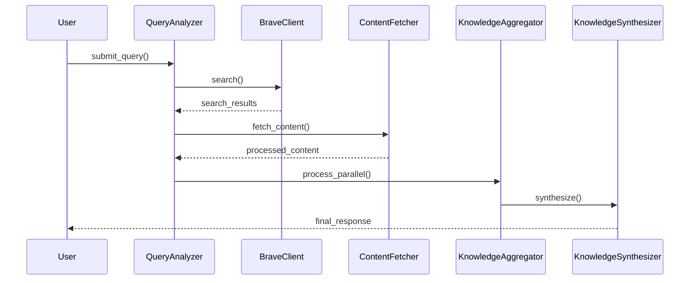
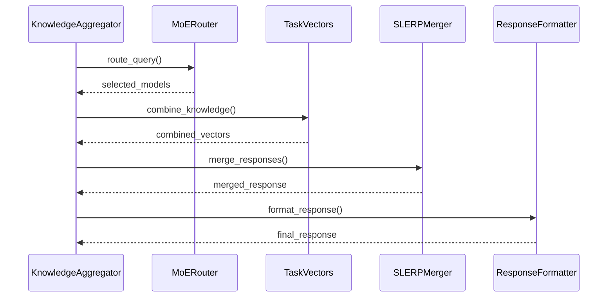

# Brave Search Knowledge Aggregator - Component Interactions

## System Overview

The Brave Search Knowledge Aggregator consists of several interacting components that work together to process queries, fetch content, and synthesize responses. This document details how these components interact.

## Core Components

### 1. Query Flow


### 2. Knowledge Synthesis Flow


## Component Responsibilities

### 1. Query Analyzer
- Receives user queries
- Determines search strategy
- Coordinates with BraveClient
- Manages content fetching

### 2. Knowledge Aggregator
- Manages parallel processing
- Coordinates source-specific handling
- Resolves conflicts between sources
- Preserves source nuances
- Tracks performance metrics

### 3. Knowledge Synthesizer
- Implements MoE routing
- Manages task vector operations
- Handles SLERP-based merging
- Supports multiple synthesis modes

## Inter-Component Communication

### 1. Data Structures
```python
@dataclass
class QueryAnalysis:
    query: str
    search_strategy: SearchStrategy
    parameters: Dict[str, Any]

@dataclass
class ProcessedContent:
    content: str
    metadata: Dict[str, Any]
    source: str
    confidence: float

@dataclass
class SynthesisResult:
    content: str
    sources: List[str]
    confidence: float
    metadata: Dict[str, Any]
```

### 2. Communication Patterns

#### Query Processing
```python
# Query Analysis
analysis = query_analyzer.analyze_query(query)
search_results = brave_client.search(analysis.search_string)
processed_content = content_fetcher.fetch_content(search_results)

# Knowledge Processing
aggregated_results = knowledge_aggregator.process_parallel(
    query=query,
    content=processed_content,
    preserve_nuances=True
)

# Synthesis
final_response = knowledge_synthesizer.synthesize(
    query=query,
    results=aggregated_results,
    mode="research"
)
```

## Feature Flag Integration

### 1. Component Selection
```python
# Feature flag checks in component factory
def get_synthesizer(config: Config) -> BaseSynthesizer:
    if FeatureFlags.is_enabled('use_new_aggregator'):
        return KnowledgeSynthesizer(config)
    return LegacySynthesizer(config)
```

### 2. Feature-Specific Behavior
```python
class KnowledgeAggregator:
    def process_parallel(self, query: str, sources: List[str]) -> AggregationResult:
        if FeatureFlags.is_enabled('enable_parallel_processing'):
            return await self._process_parallel(query, sources)
        return await self._process_sequential(query, sources)
```

## Error Handling

### 1. Component-Level Handling
```python
class KnowledgeSynthesizer:
    async def synthesize(self, query: str, results: List[Dict]) -> SynthesisResult:
        try:
            route = await self.route_query(query)
            combined = await self.combine_knowledge(results)
            merged = await self.merge_responses(combined)
            return self.format_result(merged)
        except SynthesisError as e:
            logger.error(f"Synthesis failed: {e}")
            if FeatureFlags.is_enabled('use_new_aggregator'):
                return await self.fallback_synthesis(query, results)
            raise
```

### 2. Cross-Component Recovery
```python
class QueryProcessor:
    async def process(self, query: str) -> ProcessingResult:
        try:
            return await self._process_with_new_system(query)
        except Exception as e:
            logger.error(f"New system failed: {e}")
            if self.should_fallback():
                return await self._process_with_legacy_system(query)
            raise
```

## Performance Monitoring

### 1. Metrics Collection
```python
class PerformanceMonitor:
    def track_operation(self, operation: str, duration: float):
        self.metrics[operation].append(duration)
        if FeatureFlags.is_enabled('enable_detailed_metrics'):
            self.detailed_metrics[operation].append({
                'duration': duration,
                'timestamp': time.time(),
                'memory_usage': psutil.Process().memory_info().rss
            })
```

### 2. Health Checks
```python
class SystemHealth:
    def check_component_health(self) -> Dict[str, bool]:
        return {
            'query_analyzer': self.check_analyzer(),
            'brave_client': self.check_client(),
            'aggregator': self.check_aggregator(),
            'synthesizer': self.check_synthesizer()
        }
```

## Testing Considerations

### 1. Integration Testing
```python
@pytest.mark.integration
async def test_component_interaction():
    query = "test query"
    
    # Test complete flow
    analyzer = QueryAnalyzer()
    aggregator = KnowledgeAggregator()
    synthesizer = KnowledgeSynthesizer()
    
    analysis = await analyzer.analyze_query(query)
    assert analysis.is_valid
    
    results = await aggregator.process_parallel(query, analysis)
    assert results.all_sources_processed
    
    response = await synthesizer.synthesize(query, results)
    assert response.is_coherent
```

### 2. Performance Testing
```python
@pytest.mark.performance
async def test_parallel_processing():
    aggregator = KnowledgeAggregator()
    
    start_time = time.time()
    results = await aggregator.process_parallel(
        query="test query",
        sources=["brave_search", "llm1", "llm2"]
    )
    duration = time.time() - start_time
    
    assert duration < 2.0  # Maximum 2 seconds
    assert results.all_sources_processed
    assert results.performance_metrics['processing_time'] < 1.5
```

## Future Considerations

### 1. Planned Enhancements
- Improved error recovery mechanisms
- Enhanced performance monitoring
- Advanced conflict resolution
- Sophisticated source weighting

### 2. Scalability Improvements
- Enhanced parallel processing
- Optimized vector operations
- Improved caching strategies
- Better resource utilization