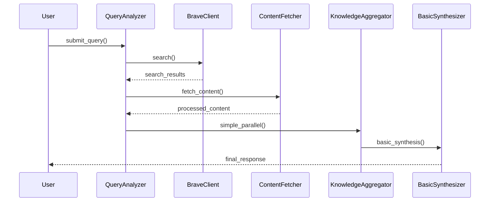
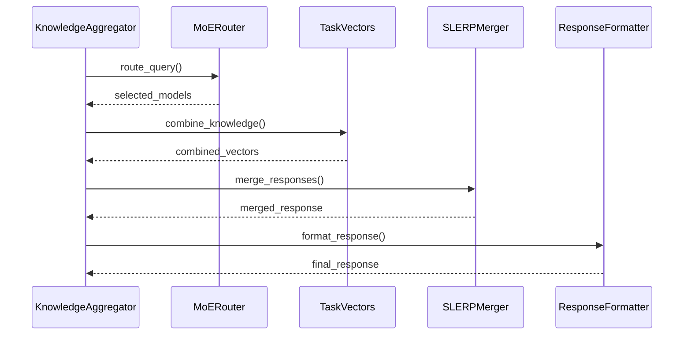
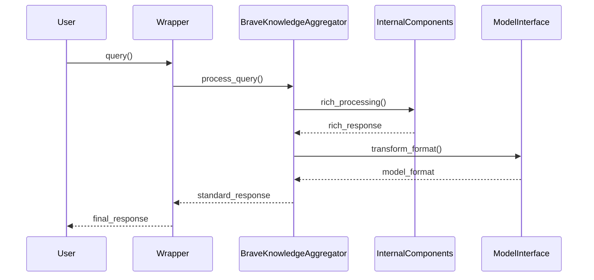
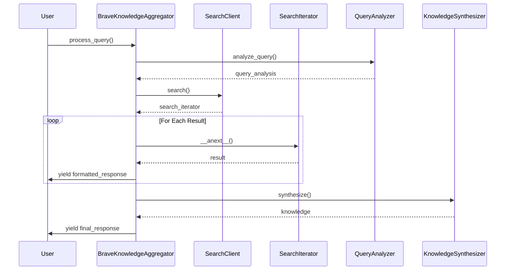

# Brave Search Knowledge Aggregator - Component Interactions

## System Overview

The Brave Search Knowledge Aggregator consists of several interacting components that work together to process queries, fetch content, and synthesize responses. This document details how these components interact, including both MVP and advanced features.

## Core Components

### 1. Basic Query Flow (MVP)


### 2. Advanced Query Flow (Implemented, Under Testing)


### 3. Model Interface Flow (Implemented)


### 3. Model Interface Flow (Implemented)

### 4. Async Iterator Pattern Flow (Implemented)



## Component Responsibilities

### 1. Query Analyzer (MVP)
- Receives user queries
- Basic query validation
- Coordinates with BraveClient
- Simple content fetching

### 2. Knowledge Aggregator
#### MVP Features
- Basic parallel processing
- Simple result combination
- Basic error handling

#### Advanced Features (Under Testing)
- Source-specific processing
- Conflict resolution
- Nuance preservation
- Performance metrics

### 3. Knowledge Synthesizer
#### MVP Features
- Basic response combination
- Simple result formatting
- Reference tracking

#### Advanced Features (Under Testing)
- MoE routing framework
- Task vector operations
- SLERP-based merging
- Multiple synthesis modes

### 4. Model Interface
#### Core Features
- Standard model response format
- Streaming compatibility
- Error format standardization
- Session handling

#### Internal Features
- Rich response preservation
- Enhanced error context
- Metadata handling
- Format transformation

### 5. Async Iterator Components
#### Search Client
- Implements async iterator protocol
- Manages API interactions
- Handles rate limiting
- Provides streaming results

#### Search Iterator
- Implements __aiter__ and __anext__
- Manages result pagination
- Handles API request timing
- Maintains iterator state

#### Aggregator Integration
- Proper coroutine handling
- Streaming response format
- Error propagation
- Resource cleanup

## Inter-Component Communication

### 1. Data Structures
```python
@dataclass
class QueryAnalysis:
    query: str
    search_strategy: SearchStrategy
    parameters: Dict[str, Any]

@dataclass
class ProcessedContent:
    content: str
    metadata: Dict[str, Any]
    source: str
    confidence: float

@dataclass
class SynthesisResult:
    content: str
    sources: List[str]
    confidence: float
    metadata: Dict[str, Any]
```

### 2. Communication Patterns

#### Basic Processing (MVP)
```python
# Query Analysis
analysis = query_analyzer.analyze_query(query)
search_results = brave_client.search(analysis.search_string)
processed_content = content_fetcher.fetch_content(search_results)

# Simple Processing
aggregated_results = knowledge_aggregator.simple_parallel(
    query=query,
    content=processed_content
)

# Basic Synthesis
final_response = knowledge_synthesizer.basic_synthesis(
    query=query,
    results=aggregated_results
)
```

#### Advanced Processing (Under Testing)
```python
# Advanced Processing
aggregated_results = await knowledge_aggregator.process_parallel(
    query=query,
    content=processed_content,
    use_advanced_features=True
)

# Advanced Synthesis
final_response = await knowledge_synthesizer.synthesize(
    query=query,
    results=aggregated_results,
    use_advanced_features=True
)
```

## Feature Flag Integration

### 1. Component Selection
```python
class KnowledgeSynthesizer:
    async def synthesize(
        self,
        query: str,
        results: List[Dict[str, str]],
        use_advanced_features: bool = False
    ) -> SynthesisResult:
        if not use_advanced_features:
            return await self.basic_synthesis(query, results)
            
        # Advanced path (when feature flag enabled)
        try:
            route = await self.route_query(query)
            combined = await self.combine_knowledge(results)
            return await self.merge_responses(combined)
        except Exception as e:
            logger.warning(f"Advanced synthesis failed: {e}, falling back to basic")
            return await self.basic_synthesis(query, results)
```

### 2. Feature-Specific Behavior
```python
class KnowledgeAggregator:
    async def process_parallel(
        self,
        query: str,
        sources: List[str],
        use_advanced_features: bool = False
    ) -> AggregationResult:
        if not use_advanced_features:
            return await self.simple_parallel(query, sources)
            
        try:
            results = await asyncio.gather(*[
                self.process_source(source, query)
                for source in sources
            ])
            return await self.resolve_conflicts(results)
        except Exception as e:
            logger.warning(f"Advanced processing failed: {e}, falling back to basic")
            return await self.simple_parallel(query, sources)
```

## Error Handling

### 1. MVP Error Handling
```python
class BasicSynthesizer:
    async def basic_synthesis(self, query: str, results: List[Dict]) -> SynthesisResult:
        try:
            combined = self.combine_results(results)
            return self.format_basic_result(combined)
        except Exception as e:
            logger.error(f"Basic synthesis failed: {e}")
            return self.create_error_response(str(e))
```

### 2. Advanced Error Handling with Fallback
```python
class KnowledgeSynthesizer:
    async def synthesize(self, query: str, results: List[Dict]) -> SynthesisResult:
        if not self.use_advanced_features:
            return await self.basic_synthesis(query, results)
            
        try:
            route = await self.route_query(query)
            combined = await self.combine_knowledge(results)
            merged = await self.merge_responses(combined)
            return self.format_result(merged)
        except Exception as e:
            logger.warning(f"Advanced synthesis failed: {e}, falling back to basic")
            return await self.basic_synthesis(query, results)
```

## Testing Strategy

### 1. Basic Feature Testing (MVP)
```python
@pytest.mark.integration
async def test_basic_flow():
    """Test basic MVP functionality."""
    query = "test query"
    analyzer = QueryAnalyzer()
    aggregator = KnowledgeAggregator()
    synthesizer = KnowledgeSynthesizer()
    
    # Test basic flow
    analysis = await analyzer.analyze_query(query)
    assert analysis.is_valid
    
    results = await aggregator.simple_parallel(query)
    assert len(results) > 0
    
    response = await synthesizer.basic_synthesis(query, results)
    assert response.content
```

### 2. Advanced Feature Testing
```python
@pytest.mark.integration
async def test_advanced_flow():
    """Test advanced features with fallback."""
    query = "test query"
    aggregator = KnowledgeAggregator()
    synthesizer = KnowledgeSynthesizer()
    
    # Test with advanced features
    results = await aggregator.process_parallel(
        query=query,
        use_advanced_features=True
    )
    assert results.content
    
    # Verify fallback works
    results_basic = await aggregator.process_parallel(
        query=query,
        use_advanced_features=False
    )
    assert results_basic.content
```

## Next Steps

### 1. Immediate Focus (MVP)
- Complete real-world testing of basic functionality
- Verify error handling and fallback mechanisms
- Document actual performance characteristics
- Stabilize core features

### 2. Post-MVP Enhancements
- Enhance existing advanced features
- Improve parallel processing efficiency
- Optimize vector operations
- Expand synthesis capabilities

Note: Focus remains on stabilizing current features and completing MVP functionality before expanding advanced capabilities.