# Brave Search Knowledge Aggregator - Component Interactions

## System Overview

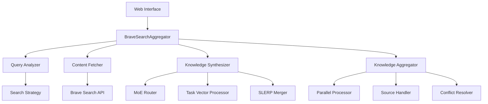

## Data Flow

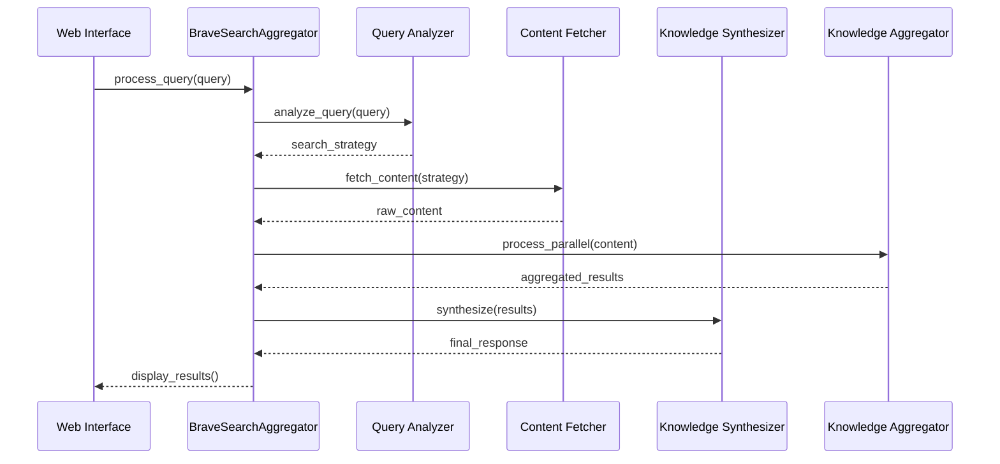

## Component Responsibilities

### Query Processing Flow

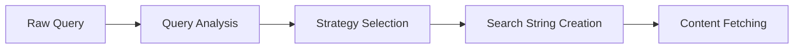

### Knowledge Synthesis Flow

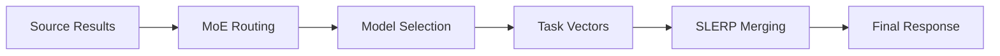

### Parallel Processing Flow

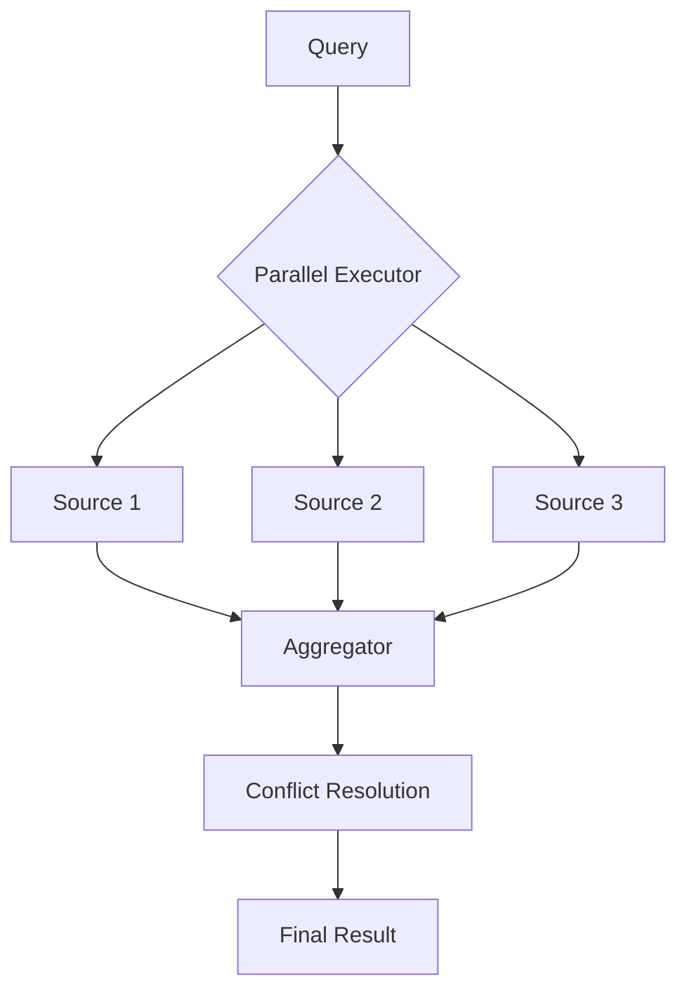

## State Transitions

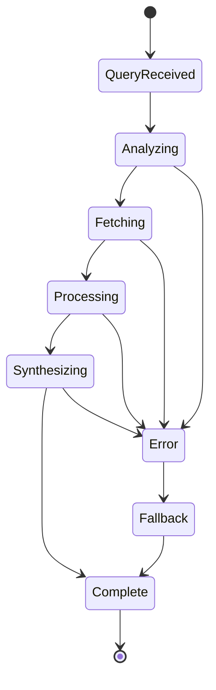

## Feature Flag Dependencies

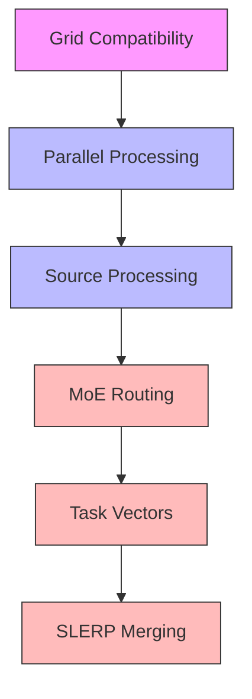

## Error Handling Flow

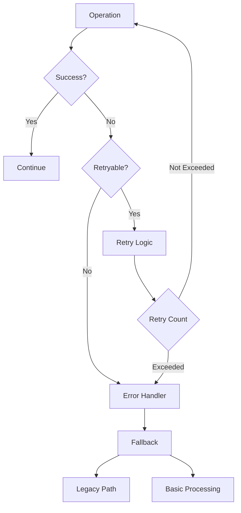

## Grid Integration

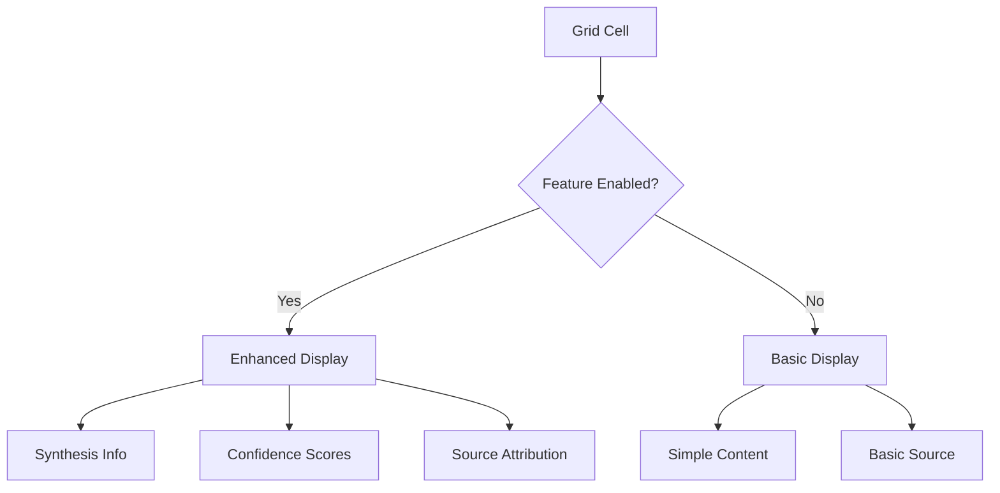

## Monitoring Points

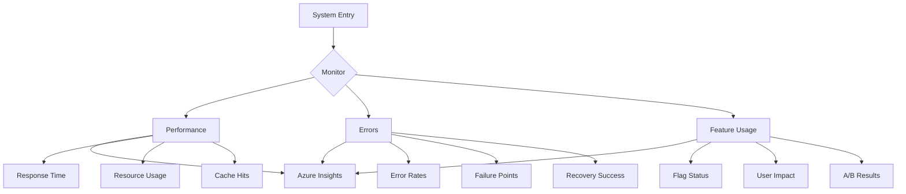

## Cache Architecture

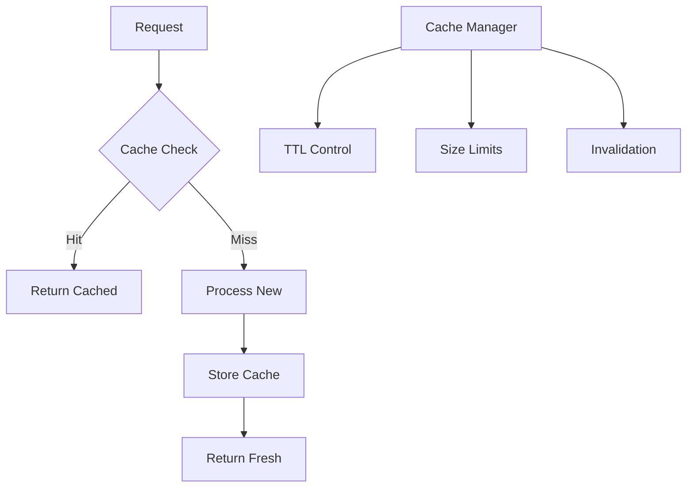

## Deployment Stages

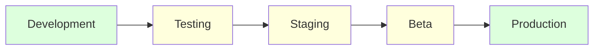

These diagrams provide a comprehensive view of how components interact within the system. They should be used in conjunction with the written documentation to understand the system's behavior and flow.

## Notes

1. All diagrams are generated using Mermaid.js syntax
2. Colors indicate:
   - Green: Active/Stable
   - Yellow: In Progress/Beta
   - Red: Requires Attention
3. Arrows indicate data/control flow
4. Boxes represent discrete components or states
5. Diamonds represent decision points

## Updates

This document should be updated when:
1. New components are added
2. Flow patterns change
3. Feature flags are modified
4. Integration points are updated
5. Error handling patterns change