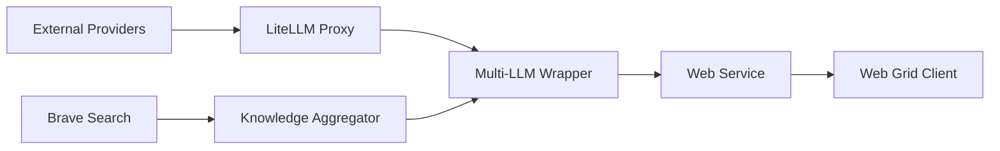
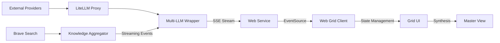

# Streaming Integration Technical Analysis and Implementation Plan

## High-Level Overview

The Multi-LLM Web Grid project requires several enhancements to achieve full streaming functionality from backend providers through to the frontend client. This document outlines the current state, required improvements, and implementation details for each component.

## 1. System Architecture Overview

### Current Implementation


### Enhanced Streaming Architecture


## 2. Component Analysis and Requirements

### 2.1 Backend Components

#### 2.1.1 Knowledge Aggregator
Current Status:
- Streaming implementation exists but only tested via pytest
- Basic event types implemented
- Memory management implemented but not stress-tested

Required Updates:
```python
class BraveKnowledgeAggregator:
    async def process_query(self, query: str) -> AsyncIterator[Dict[str, Any]]:
        # Add new event types
        yield {
            "type": "status",
            "stage": "analysis_started",
            "timestamp": time.time()
        }
        
        # Add progress tracking
        async for result in self._process_stream():
            yield {
                "type": "interim_analysis",
                "content": result.content,
                "progress": result.progress,
                "metrics": {
                    "memory_usage": self.resource_manager.current_memory_mb,
                    "processing_time": result.processing_time
                }
            }
```

#### 2.1.2 Content Enricher
Required Updates:
```python
class ContentEnricher:
    async def enrich_stream(
        self, 
        content_stream: AsyncIterator[Dict[str, Any]]
    ) -> AsyncIterator[EnrichedContent]:
        # Add streaming metrics
        metrics = {
            "start_time": time.time(),
            "processed_items": 0,
            "current_batch": []
        }
        
        try:
            async for content in content_stream:
                # Add batch processing metrics
                if len(metrics["current_batch"]) >= self.batch_size:
                    yield {
                        "type": "batch_complete",
                        "metrics": {
                            "batch_size": len(metrics["current_batch"]),
                            "processing_time": time.time() - metrics["start_time"]
                        }
                    }
```

### 2.2 Service Layer

#### 2.2.1 LLM Service
Required Updates:
```python
class LLMService:
    async def stream_llm_response(
        self, 
        llm_index: int,
        query: str,
        session_id: str
    ) -> AsyncGenerator[str, None]:
        # Add streaming state management
        state = StreamingState(
            session_id=session_id,
            llm_index=llm_index,
            start_time=time.time()
        )
        
        try:
            # Stream with progress updates
            async for chunk in self._stream_with_progress(query, state):
                yield self._format_sse_event(chunk)
                
        except StreamingError as e:
            # Enhanced error recovery
            yield self._format_sse_event({
                "type": "error",
                "error": str(e),
                "recoverable": e.is_recoverable,
                "partial_result": e.partial_result
            })
```

### 2.3 Web Interface

#### 2.3.1 Event Handling (streams.js)
Required Updates:
```javascript
// New event types and handlers
const EVENT_TYPES = {
    STATUS: 'status',
    CONTENT: 'content',
    INTERIM_ANALYSIS: 'interim_analysis',
    SEARCH_RESULT: 'search_result',
    FINAL_SYNTHESIS: 'final_synthesis',
    ERROR: 'error'
};

class StreamHandler {
    constructor(llmIndex) {
        this.llmIndex = llmIndex;
        this.state = {
            accumulatedText: '',
            analysisResults: [],
            startTime: Date.now(),
            metrics: {
                processedChunks: 0,
                totalBytes: 0,
                lastUpdateTime: Date.now()
            }
        };
    }

    handleEvent(event) {
        const data = parseSSEData(event.data);
        switch (data.type) {
            case EVENT_TYPES.STATUS:
                this.updateStatus(data);
                break;
            case EVENT_TYPES.INTERIM_ANALYSIS:
                this.handleInterimAnalysis(data);
                break;
            // Add handlers for other event types
        }
    }
}
```

#### 2.3.2 UI Components
Required Updates:
```javascript
class LLMWindow {
    constructor(index) {
        this.index = index;
        this.contentElement = document.querySelector(`#llm-${index} .markdown-body`);
        this.metrics = new MetricsTracker();
    }

    updateContent(content, isStreaming = true) {
        if (isStreaming) {
            // Optimize for streaming updates
            this.streamUpdate(content);
        } else {
            // Full content replacement
            this.fullUpdate(content);
        }
        
        // Update metrics
        this.metrics.recordUpdate({
            contentLength: content.length,
            timestamp: Date.now()
        });
    }

    streamUpdate(content) {
        // Implement efficient DOM updates for streaming
        const lastChild = this.contentElement.lastElementChild;
        if (lastChild && !lastChild.isComplete) {
            // Update existing incomplete element
            this.updateIncompleteElement(lastChild, content);
        } else {
            // Create new streaming element
            this.appendStreamingElement(content);
        }
    }
}
```

## 3. Testing Requirements

### 3.1 Real-World Testing Scenarios

#### 3.1.1 Browser Testing Suite
```javascript
// browser-tests/streaming.test.js
describe('Streaming Performance', () => {
    test('Memory Usage Under Load', async () => {
        const metrics = await measureStreamingMemory({
            duration: '5m',
            concurrent_streams: 10,
            content_size: '1MB'
        });
        
        expect(metrics.peakMemory).toBeLessThan(100 * 1024 * 1024); // 100MB
        expect(metrics.memoryLeaks).toBe(0);
    });
    
    test('UI Responsiveness', async () => {
        const performance = await measureUIPerformance({
            action: 'scroll',
            during: 'active_streaming',
            duration: '30s'
        });
        
        expect(performance.frameDrops).toBeLessThan(5);
        expect(performance.avgFrameTime).toBeLessThan(16); // 60fps
    });
});
```

#### 3.1.2 Integration Testing
```python
# tests/integration/test_streaming_pipeline.py
async def test_end_to_end_streaming():
    # Initialize components
    aggregator = BraveKnowledgeAggregator()
    service = LLMService()
    
    # Start test server
    async with TestServer() as server:
        # Connect test client
        async with TestClient(server.app) as client:
            # Send test query
            response = await client.post("/query", json={
                "query": "test query",
                "stream": True
            })
            
            # Verify streaming response
            events = []
            async for event in response.iter_content():
                events.append(parse_sse_event(event))
                
            # Verify event sequence
            assert_event_sequence(events, [
                "analysis_started",
                "search_results",
                "interim_analysis",
                "final_synthesis"
            ])
```

### 3.2 Performance Testing

#### 3.2.1 Memory Management
```python
# tests/performance/test_memory.py
async def test_memory_under_load():
    # Configure test parameters
    config = PerformanceConfig(
        concurrent_streams=10,
        duration_seconds=300,
        max_memory_mb=100,
        check_interval_ms=100
    )
    
    # Run load test
    async with MemoryMonitor() as monitor:
        results = await run_load_test(config)
        
        # Verify memory usage
        assert max(monitor.measurements) < config.max_memory_mb
        assert monitor.leak_detected == False
```

#### 3.2.2 Browser Performance
```javascript
// tests/browser/performance.test.js
describe('Browser Performance', () => {
    test('Memory Usage', async () => {
        const memoryProfile = await collectMemoryProfile({
            duration: '5m',
            action: 'streaming'
        });
        
        expect(memoryProfile.heapGrowth).toBeLessThan(1024 * 1024); // 1MB
    });
    
    test('CPU Usage', async () => {
        const cpuProfile = await collectCPUProfile({
            duration: '5m',
            action: 'streaming'
        });
        
        expect(cpuProfile.averageUsage).toBeLessThan(70); // 70% CPU max
    });
});
```

## 4. Implementation Priorities

1. Backend Streaming Enhancement
   - Implement new event types
   - Add progress tracking
   - Enhance error recovery

2. Service Layer Updates
   - Add streaming state management
   - Implement progress monitoring
   - Enhance error handling

3. Frontend Integration
   - Update event handlers
   - Implement efficient UI updates
   - Add performance monitoring

4. Testing Infrastructure
   - Implement browser testing suite
   - Add performance monitoring
   - Create real-world test scenarios

## 5. Success Criteria

1. Performance Metrics
   - First Status: < 100ms
   - First Result: < 1s
   - Memory Usage: < 100MB
   - CPU Usage: < 70%
   - Frame Rate: > 30fps

2. Reliability Metrics
   - Error Rate: < 1%
   - Recovery Rate: > 99%
   - Zero memory leaks

3. User Experience Metrics
   - UI Responsiveness: < 100ms
   - Smooth scrolling
   - Consistent updates

## 6. Next Steps

1. Review and approve technical specifications
2. Create detailed task breakdown
3. Implement high-priority updates
4. Deploy testing infrastructure
5. Conduct real-world testing
6. Document findings and optimizations

This plan will be updated based on implementation feedback and testing results.